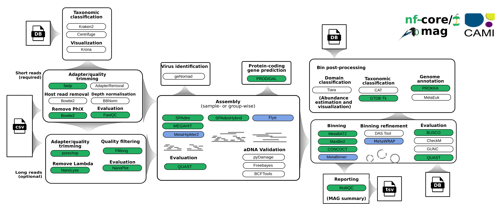

## Introduction

This pipeline is a modified version of the nf-core/mag workflow, which was adapted to incorporate metagenomic methods recognized for their performance in the CAMI2 benchmark.  To broaden the utility and applicability of the workflow, we have integrated support for only long reads data, incorporating the long-read assembler [Flye](https://github.com/fenderglass/Flye). For the short reads data, the best performing short-read assembler [MetaHipMer](https://bitbucket.org/berkeleylab/mhm2/src/master/) in CAMI2 benchmark was included. Moreover, the workflow now incorporates additional well performing metagenome binners and bin refinement tools, such as [MetaBinner](https://github.com/ziyewang/MetaBinner), and [MetaWRAP](https://github.com/bxlab/metaWRAP). 


The pipeline is built using [Nextflow](https://www.nextflow.io), a workflow tool to run tasks across multiple compute infrastructures in a portable manner. It uses Docker containers to facilitate installation and make results reproducible. The [Nextflow DSL2](https://www.nextflow.io/docs/latest/dsl2.html) implementation of this pipeline uses one container per process, which makes it much easier to maintain and update software dependencies. Where possible, these processes have been submitted to and installed from [nf-core/modules](https://github.com/nf-core/modules) to make them available to all nf-core pipelines, and to everyone within the Nextflow community!

<picture>
    
</picture>

## Pipeline summary

By default, the pipeline currently performs the following: it supports both short and long reads, quality trims the reads and adapters with [fastp](https://github.com/OpenGene/fastp) and [Porechop](https://github.com/rrwick/Porechop), and performs basic QC with [FastQC](https://www.bioinformatics.babraham.ac.uk/projects/fastqc/).
The pipeline then:

- assigns taxonomy to reads using [Centrifuge](https://ccb.jhu.edu/software/centrifuge/) and/or [Kraken2](https://github.com/DerrickWood/kraken2/wiki)
- performs assembly using [MEGAHIT](https://github.com/voutcn/megahit), [MetaHipMer](https://bitbucket.org/berkeleylab/mhm2/src/master/), [SPAdes](http://cab.spbu.ru/software/spades/), long reads assembler [Flye](https://github.com/fenderglass/Flye) and checks their quality using [Quast](http://quast.sourceforge.net/quast).
- (optionally) performs ancient DNA assembly validation using [PyDamage](https://github.com/maxibor/pydamage) and contig consensus sequence recalling with [Freebayes](https://github.com/freebayes/freebayes) and [BCFtools](http://samtools.github.io/bcftools/bcftools.html)
- predicts protein-coding genes for the assemblies using [Prodigal](https://github.com/hyattpd/Prodigal)
- performs metagenome binning using [MetaBAT2](https://bitbucket.org/berkeleylab/metabat/src/master/), [MaxBin2](https://sourceforge.net/projects/maxbin2/), and/or with [CONCOCT](https://github.com/BinPro/CONCOCT), [MetaBinner](https://github.com/ziyewang/MetaBinner) and checks the quality of the genome bins using [Busco](https://busco.ezlab.org/), or [CheckM](https://ecogenomics.github.io/CheckM/), and optionally [GUNC](https://grp-bork.embl-community.io/gunc/).
- optionally refines bins with [DAS Tool](https://github.com/cmks/DAS_Tool), and [MetaWRAP](https://github.com/bxlab/metaWRAP)
- assigns taxonomy to bins using [GTDB-Tk](https://github.com/Ecogenomics/GTDBTk) and/or [CAT](https://github.com/dutilh/CAT)

Furthermore, the pipeline creates various reports in the results directory specified, including a [MultiQC](https://multiqc.info/) report summarizing some of the findings and software versions.

## Quick Start

Start running your own analysis!

   ```bash
   nextflow run nf-core/mag --input '*_R{1,2}.fastq.gz' --outdir <OUTDIR>
   ```

   or

```bash
nextflow run nf-core/mag --input samplesheet.csv --outdir <OUTDIR>
```

See [usage docs](https://nf-co.re/mag/usage) and [parameter docs](https://nf-co.re/mag/parameters) for all of the available options when running the pipeline.

## Documentation

The nf-core/mag pipeline comes with documentation about the pipeline [usage](https://nf-co.re/mag/usage), [parameters](https://nf-co.re/mag/parameters) and [output](https://nf-co.re/mag/output). Detailed information about how to specify the input can be found under [input specifications](https://nf-co.re/mag/usage#input_specifications).

### Group-wise co-assembly and co-abundance computation

Each sample has an associated group ID (see [input specifications](https://nf-co.re/mag/usage#input_specifications)). This group information can be used for group-wise co-assembly with `MEGAHIT` or `SPAdes` or `MetaHipMer2` and/or to compute co-abundances for the binning step with `MetaBAT2`. By default, group-wise co-assembly is disabled, while the computation of group-wise co-abundances is enabled. For more information about how this group information can be used see the documentation for the parameters [`--coassemble_group`](https://nf-co.re/mag/parameters#coassemble_group) and [`--binning_map_mode`](https://nf-co.re/mag/parameters#binning_map_mode).

When group-wise co-assembly is enabled, `SPAdes` is run on accordingly pooled read files, since `metaSPAdes` does not yet allow the input of multiple samples or libraries. In contrast, `MEGAHIT` is run for each group while supplying lists of the individual readfiles.

## Credits

The original nf-core/mag (https://nf-co.re/mag/) was written by [Hadrien Gourlé](https://hadriengourle.com) at [SLU](https://slu.se), [Daniel Straub](https://github.com/d4straub) and [Sabrina Krakau](https://github.com/skrakau) at the [Quantitative Biology Center (QBiC)](http://qbic.life). [James A. Fellows Yates](https://github.com/jfy133) and [Maxime Borry](https://github.com/maxibor) at the [Max Planck Institute for Evolutionary Anthropology](https://www.eva.mpg.de) joined in version 2.2.0.

This modified version was adapted by [Hesham Almessady](https://github.com/HeshamAlmessady), [Zhi-Luo Deng](https://github.com/dawnmy) and [Adrian Fritz](https://github.com/AlphaSquad) at the Helmholtz Centre for Infection Research.

## Contributions and Support

If you would like to contribute to this pipeline, please see the [contributing guidelines](.github/CONTRIBUTING.md).

For further information or help, don't hesitate to get in touch with [Hesham Almessady](hesham.almessady@helmholtz-hzi.de) or [Zhi-Luo Deng](zhiluo.deng@helmholtz-hzi.de)

## Citations

If you use nf-core/mag for your analysis, please cite the preprint as follows:

> **nf-core/mag: a best-practice pipeline for metagenome hybrid assembly and binning**
>
> Sabrina Krakau, Daniel Straub, Hadrien Gourlé, Gisela Gabernet, Sven Nahnsen.
>
> NAR Genom Bioinform. 2022 Feb 2;4(1):lqac007. doi: [10.1093/nargab/lqac007](https://doi.org/10.1093/nargab/lqac007).

additionally you can cite the pipeline directly with the following doi: [10.5281/zenodo.3589527](https://doi.org/10.5281/zenodo.3589527)

An extensive list of references for the tools used by the pipeline can be found in the [`CITATIONS.md`](CITATIONS.md) file.

You can cite the `nf-core` publication as follows:

> **The nf-core framework for community-curated bioinformatics pipelines.**
>
> Philip Ewels, Alexander Peltzer, Sven Fillinger, Harshil Patel, Johannes Alneberg, Andreas Wilm, Maxime Ulysse Garcia, Paolo Di Tommaso & Sven Nahnsen.
>
> _Nat Biotechnol._ 2020 Feb 13. doi: [10.1038/s41587-020-0439-x](https://dx.doi.org/10.1038/s41587-020-0439-x).
